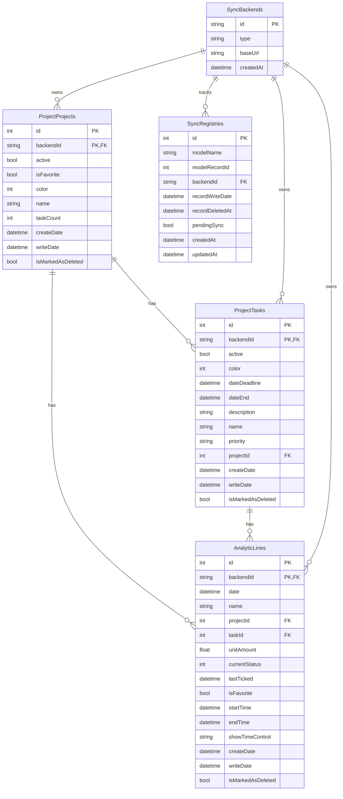

# flutter-odoo-timesheets

Odoo timesheets Flutter project

### Initialize git

    `git init`

### Enable pre-commit manually

After git initialization use `chmod +x tools/install-hook.bash && ./tools/install-hook.bash && chmod ug+x .git/hooks/pre-commit`

### DB Diagram

